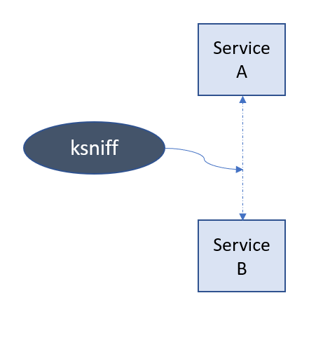
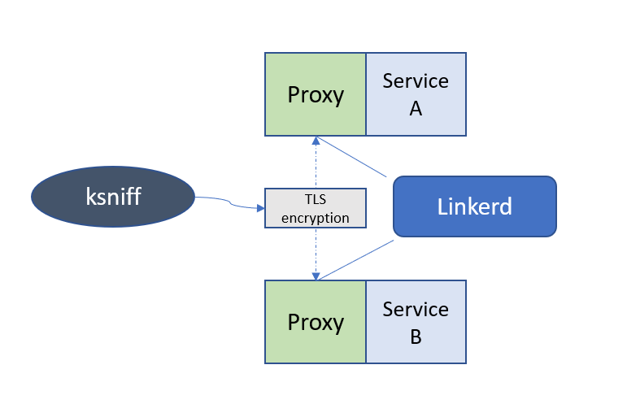

Linkerd, with the use of proxy sidecars, is capable of service-to-service
encryption. For that purpose it uses mTLS, which stands for mutual TLS.
With the use of it every meshed service is capable of authenticating any
request by a workload certificate derived from its Kubernetes ServiceAccount
token.

Without the usage of Linkerd, there is a risk of malicious eavesdropper which
could sniff the communication, e.g. from a shared messaging platform thus exposing
potentially sensitive data. Note that when using encryption provided by Linkerd,
the risk is substantially lowered, which is pointed out in latest security audit [@linkerd:audit].
One of the points of this case study is to show the difference.

We plan on using a "sniffer" to observe the encrytpion of the communication. Two services (further called service A and Service B)
will be set up using Kubernetes. Then, ksniff [@git:ksniff] and Wireshark will be used to record communication between the pods,
and to potentially observe data sent.

Then, the Linkerd service mesh will be deployed, and the experiment will be repeated. This time, the Linkerd should encrytp observed
communication, thus making reading sent data impossible.

